### Hi there 👋 Welcome to my GitHub!

<!--  -->

here's some interesting things I developed:

* [ZFFramework](https://github.com/ZFFramework/ZFFramework) :
    complex and powerful C++ app framework with many interesting ideas
* [ZFVimIM](https://github.com/ZSaberLv0/ZFVimIM) :
    input method, by pure vim script
* [ZFVimDirDiff](https://github.com/ZSaberLv0/ZFVimDirDiff) :
    dir diff util like BeyondCompare, by pure vim script
* [ZFVimJob](https://github.com/ZSaberLv0/ZFVimJob) :
    group job, async run, auto script, many job related utils
* and [many handy vim plugins](https://github.com/ZSaberLv0?utf8=%E2%9C%93&tab=repositories&q=ZFVim)

# Buy me a coffee?

* [Patreon](https://www.patreon.com/ZSaberLv0)
* [PayPal](https://paypal.me/ZSaberLv0)

<table border=0 frame=void rules=none><tr>
<td></td>
<td></td>
</tr></table>

<!--
**ZSaberLv0/ZSaberLv0** is a ✨ _special_ ✨ repository because its `README.md` (this file) appears on your GitHub profile.

Here are some ideas to get you started:

- 🔭 I’m currently working on ...
- 🌱 I’m currently learning ...
- 👯 I’m looking to collaborate on ...
- 🤔 I’m looking for help with ...
- 💬 Ask me about ...
- 📫 How to reach me: ...
- 😄 Pronouns: ...
- ⚡ Fun fact: ...
-->
